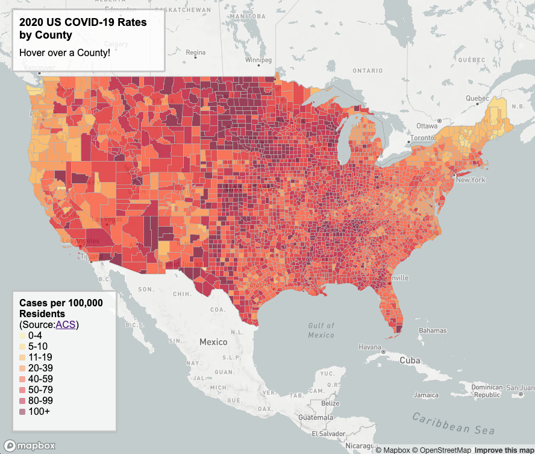
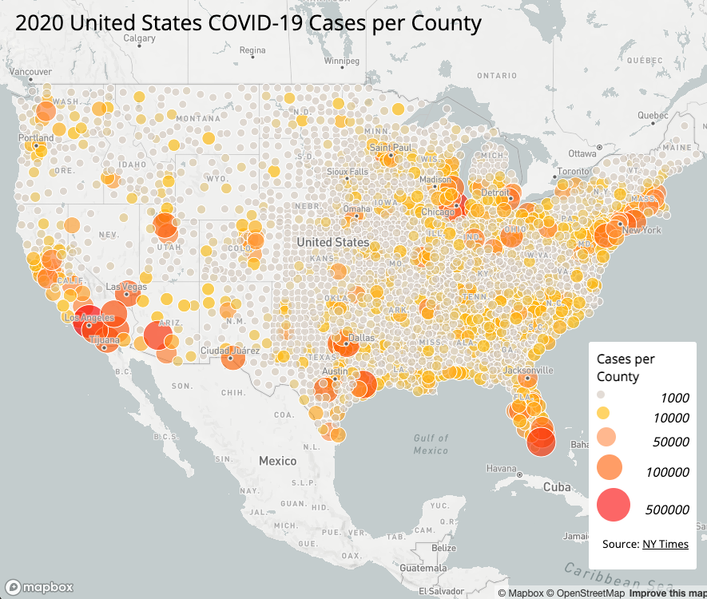

# COVID-19 Web Maps
## Lab 3 (GEOG 458 - Prof Zhao)
### By Zach Casler

##### Introduction:
I have created two maps, Map 1 is a Choropleth map displaying 2020 United States COVID-19 rates by County (rates per 100,000 residents).  Map 2 is a proportional symbol map displaying 2020 United States COVID-19 Case Counts by County.  Both maps are linked and pictured below.

Map 1 is linked [Here](https://zcasler.github.io/Caslerlab3/map1.html)

Map 2 is linked [Here](https://zcasler.github.io/Caslerlab3/map2.html)

#### Map Functions:
The functions of map 1 consist of a clickable symbol which will display the COVID-19 case count for that selected county.  For map 2 there is a mouse hover function which displays the county name and COVID-19 rate (per 100,000 residents) of whatever county the mouse is over.

#### Sources:
Both the maps use a shapefile from the [United States Census Bureau](https://www.census.gov/geographies/mapping-files/time-series/geo/carto-boundary-file.html).
The data for map 1 is from [The New York Times](https://github.com/nytimes/covid-19-data/blob/43d32dde2f87bd4dafbb7d23f5d9e878124018b8/live/us-counties.csv) and the data for map 2 is from the [2018 ACS 5 year estimates](https://data.census.gov/cedsci/table?g=0100000US%24050000&d=ACS%205-Year%20Estimates%20Data%20Profiles&tid=ACSDP5Y2018.DP05&hidePreview=true).

##### Credit:
    I have been provided instruction and some templates from Professor Bo Zhao's GEOG 458 class github respository linked [Here](https://link-url-here.org).
